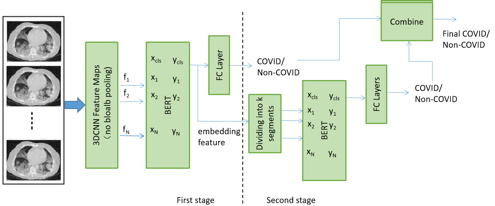

# 3D-CNN-BERT for COVID19 Classification and Embedding Feature Generation 

We use the Pytorch implementation of [Late Temporal Modeling in 3D CNN Architectures with BERT for Action Recognition], which implements late temporal modeling on top of the 3D CNN architectures with main focus on BERT. This architecture was originally used for video action recogntion. We modify it and apply it onto 3D CNN classification on 3D CT-scan volumes.   

## Dependency 
Recreate the Pytorch-1.7 Anaconda container enviroment by running conda install --name myenv --file pytorch-1.7.txt  

## Dataset preparation
Follow the instructions in preprocessing and segmentation to prepare the dataset 

## Train First-Stage 3D-CNN-BERT  
python train.py --split=1 --arch=rgb_r2plus1d_32f_34_bert10  --workers=8 --batch-size=4 --iter-size=16 --print-freq=100 --dataset=covid --dataset_root=/media/ubuntu/MyHDataStor3/datasets/COV19D  --lr=1e-5

The data generator is defined in dataset/covid.py 
Set the dataset_root to your own root directory where datasets are saved.  

## Train Second-Stage BERT on Extracted Features   
python train_feature.py --split=1 --arch=feature_bert10 --workers=8 --batch-size=32 --iter-size=16 --print-freq=100 --dataset=covid2 --dataset_root=/media/ubuntu/MyHDataStor3/datasets/COV19D --lr=1e-5

## Evuation on validation dataset  
python train.py --split=5 --arch=rgb_r2plus1d_32f_34_bert10  --workers=8 --batch-size=4 --iter-size=16 --print-freq=100 --dataset=covid--dataset_root=/media/ubuntu/MyHDataStor3/datasets/COV19D  --lr=1e-5 --evaluate 

python train_feature.py --split=1 --arch=feature_bert10 --workers=8 --batch-size=32 --iter-size=16 --print-freq=100 --dataset=covid2 --dataset_root=/media/ubuntu/MyHDataStor3/datasets/COV19D --lr=1e-5 --evaluate 

## Produce prediction on test dataset 
python train.py --split=5 --arch=rgb_r2plus1d_32f_34_bert10  --workers=8 --batch-size=4 --iter-size=16 --print-freq=100 --dataset=covid --dataset_--dataset_root=/media/ubuntu/MyHDataStor3/datasets/COV19D   --lr=1e-5 --evaluate --test 

python train_feature.py --split=1 --arch=feature_bert10 --workers=8 --batch-size=32 --iter-size=16 --print-freq=100 --dataset=covid2 --dataset_root=/media/ubuntu/MyHDataStor3/datasets/COV19D --lr=1e-5 --evaluate --test 

## Reference implementatoin
https://github.com/artest08/LateTemporalModeling3DCNN

